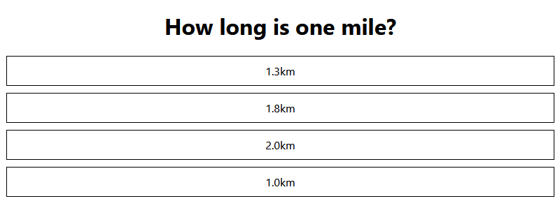

[](https://classroom.github.com/a/Pv1oBGvB)
# Web Frameworks Week Exercise 1

To goal of this exercise is to practise and demonstrate you skills in react component basics and passing
data to components via props.

You should clone this project to your own computer, write the solution for the task. Test it on your machine with 'npm test' and confirm that you pass all the test cases. Then commit and push your changes to the github classroom repository of your own.

## Task description

Task is to create a react application to represent a questionnare application. In this exercise
we are going to create only part of the application.

The application should present a question and a set of options.  
The options should be presented below the question.
The options should be presented as div boxes with a 1px black border, margin and padding of 10px.

In this phase no interactivity is required. Only rendering of the question and options is required.

The App component should receive the question and options as props. The names
of the props should be 'question' and 'options'. The question should be a string and the options
should be an array of strings.

The question and options should be passed as props to the question component. The question component is
responsible of rendering the question and options.
Any amount of options should be possible to pass to the question component.
The question component should be defined in a separate file.  
The question component should be imported into the App component.
The question component should be rendered in the App component.

The options should be rendered in the question component and there should be an option component, which
is responsible of rendering the option. The option component should be defined in a separate file.
The option component should be imported into the question component.
The option component should be given the option string to display as a prop.
Name of the question component should be Question.
Name of the option component should be Option.

The final DOM structure in the browser should look like this:

```
<div class="App">
<div class="question">
  <h1>What is the capital of Italy?</h1>
  <div class="option">Turin</div>
  <div class="option">Milan</div>
  <div class="option">Rome</div>
</div>
```

The outcome should look like in the example image below:


Notice that you must implement the DOM structure using react components. You are not allowed to
create the DOM structure in the App component. The App component should only render the question component
and the question component should render the question and options.

This project was bootstrapped with [Create React App](https://github.com/facebook/create-react-app).

## Useful Scripts for the exercise

In the project directory, you can run:

### `npm start`

Runs the app in the development mode.\
Open [http://localhost:3000](http://localhost:3000) to view it in your browser.

The page will reload when you make changes.\
You may also see any lint errors in the console.

### `npm test`

Launches the test runner in the interactive watch mode.\
This will execute the validation tests for your work. You can run the tests locally to make sure your implementation works. The github classroom will run the same tests when you commit and push to your exercise repository. 
